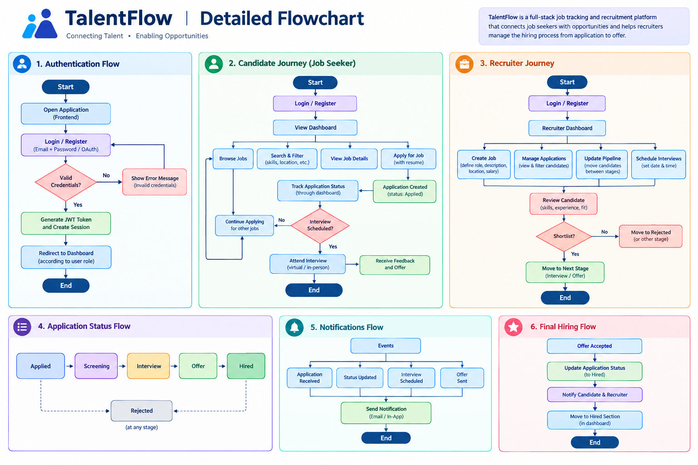
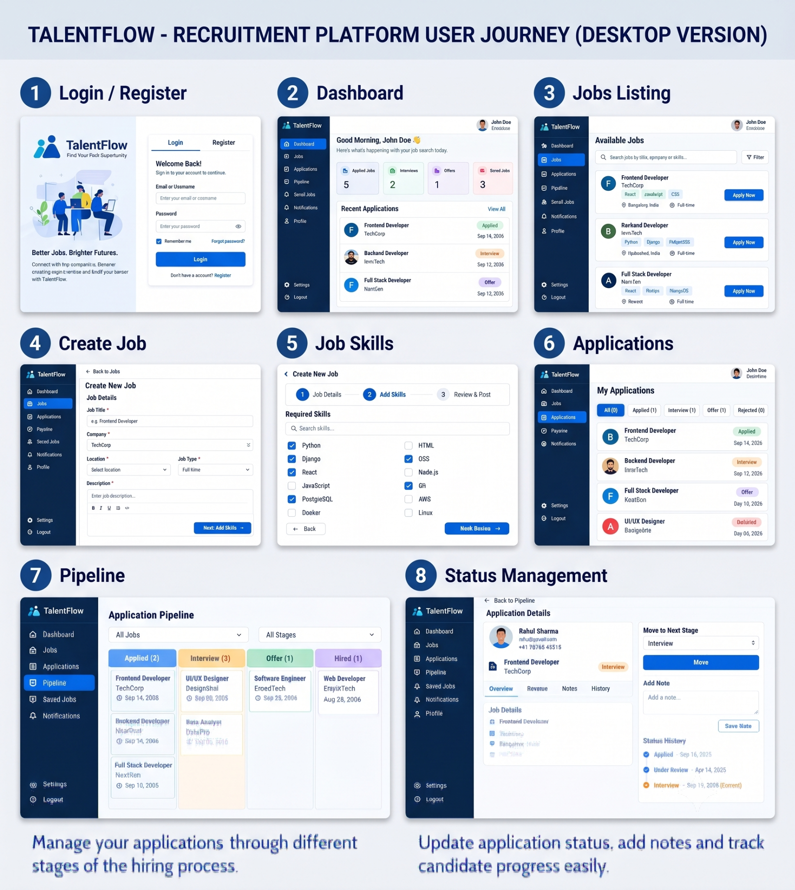
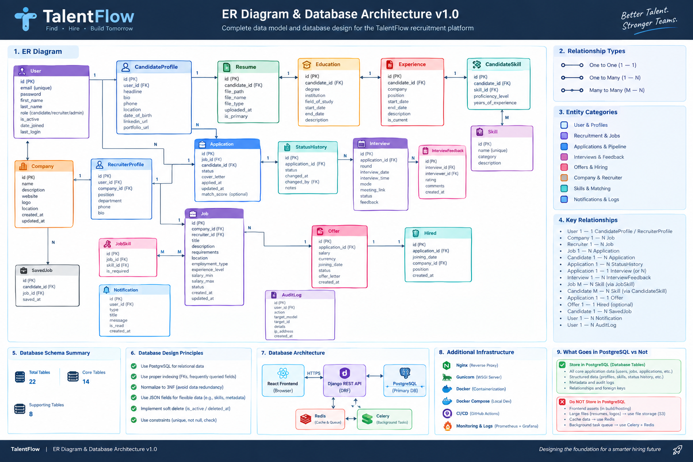

# TalentFlow

> A modern full-stack recruitment and applicant management platform built with React, Django REST Framework and PostgreSQL.

TalentFlow is designed around the complete recruitment workflow: **job creation → applications → screening → shortlist → interview → offer → hire**.

## Project Overview

TalentFlow gives candidates a place to discover jobs and apply, while recruiters get a focused workspace for managing jobs, reviewing applicants and moving candidates through a recruitment pipeline.

### Key Features

- 🔐 Token-based authentication and role-aware access
- 👤 Candidate and recruiter workflows
- 💼 Job creation and job discovery
- 🧩 Required skill selection using `skill_ids`
- 📝 Application creation and tracking
- 📋 Recruiter application management
- 🧭 Interactive recruitment pipeline
- 🔄 Application status updates from the web UI
- 🗂️ Status history and recruiter-side workflow
- 🗄️ PostgreSQL relational data model
- ⚛️ React + Vite frontend
- 🐍 Django + Django REST Framework backend
- 🐳 Docker-ready project structure

## Tech Stack

| Layer | Technology |
|---|---|
| Frontend | React, Vite, JavaScript, CSS |
| Backend | Python, Django, Django REST Framework |
| Database | PostgreSQL |
| API Auth | DRF Token Authentication |
| Icons | Lucide React |
| Infrastructure | Docker, Nginx/Gunicorn configuration |
| Version Control | Git / GitHub |

---

# 1. Detailed Flowchart



The flowchart covers authentication, candidate journey, recruiter journey, application status, notifications and the final hiring flow.

[Open the detailed-flowchart PDF](docs/detailed-flowchart.pdf)

---

# 2. Project Showcase

## Current UI / Product Showcase



This showcase presents the complete TalentFlow desktop workflow in one clear view:

**Login / Register → Dashboard → Jobs Listing → Create Job → Job Skills → Applications → Pipeline → Status Management**

---

# 3. Blueprint

The blueprint defines the product vision, users, recruitment workflow, technology direction, security principles and progressive release strategy.

[Open the Blueprint PDF](docs/blueprint.pdf)

---

# 4. ERD Diagram



The ERD shows the core relationships between users, profiles, companies, jobs, applications, skills, interviews, offers, notifications and supporting recruitment entities.

---

# 5. System Map

[Open the TalentFlow System Map / Feature Map](docs/system-map.pdf)

The system map documents the broader feature landscape and progressive development strategy.

---

# 6. System Architecture

```text
                    ┌──────────────────────┐
                    │   React + Vite UI    │
                    │  Browser / Frontend  │
                    └──────────┬───────────┘
                               │ JSON / REST
                               ▼
                    ┌──────────────────────┐
                    │ Django REST Framework│
                    │ Auth • Views • Logic  │
                    └──────────┬───────────┘
                               │ Django ORM
                               ▼
                    ┌──────────────────────┐
                    │      PostgreSQL      │
                    │     Primary Data     │
                    └──────────────────────┘
```

The current MVP follows a clear React → DRF → ORM → PostgreSQL request path.

[Open the detailed System Architecture PDF](docs/system-architecture.pdf)

---

# 7. User Roles

### Candidate

- Browse published jobs
- View job details and required skills
- Apply for jobs
- View submitted applications
- Track application status

### Recruiter

- Access recruiter dashboard
- Create jobs for their company
- Select required skills
- Review applications
- Move candidates through pipeline stages
- Manage recruitment status

### Admin / Future Platform Role

The broader blueprint includes an administrative role for platform oversight, moderation, analytics and audit activity. Advanced admin features are roadmap work rather than being presented as complete MVP functionality.

---

# 8. How to Run

## Backend

```bash
cd backend

python -m venv venv
```

### Windows

```bash
venv\Scripts\activate
```

Install dependencies:

```bash
pip install -r requirements.txt
```

Configure environment variables:

```bash
copy .env.example .env
```

Apply migrations:

```bash
python manage.py migrate
```

Run the API:

```bash
python manage.py runserver
```

Health endpoint:

```text
http://127.0.0.1:8000/api/v1/health/
```

## Frontend

Open a second terminal:

```bash
cd frontend
npm install
npm run dev
```

Open the Vite URL shown in the terminal.

---

# 9. User Manual

The complete user guide is available here:

[Open the TalentFlow User Manual](docs/user-manual.pdf)

### Quick Candidate Flow

```text
Login
  ↓
Dashboard
  ↓
Jobs
  ↓
View Job
  ↓
Apply
  ↓
Applications
  ↓
Track Status
```

### Quick Recruiter Flow

```text
Login
  ↓
Dashboard
  ↓
Create Job
  ↓
Select Skills
  ↓
Applications
  ↓
Pipeline
  ↓
Update Status
```

---

# 10. Project Deep Dive

[Open the Project Deep Dive](docs/project-deep-dive.pdf)

The deep dive explains:

- Product problem
- Domain model
- API structure
- Authentication and roles
- Database relationships
- Query optimization
- Skill relationship handling
- Application status updates
- Debugging decisions
- MVP boundaries
- Engineering approach

---

# 11. Challenges & Solutions

| Challenge | Solution |
|---|---|
| Stale authentication token after token rotation | Cleared local demo token and re-authenticated |
| Candidate demo password mismatch | Reset the demo password through Django shell |
| Pipeline was initially display-only | Added a status selector and PATCH-based update flow |
| Job skills needed many-to-many input | Added write-only `skill_ids` and verified JobSkill associations |
| Related data could cause unnecessary queries | Used `select_related` and `prefetch_related` |
| Need to distinguish MVP from roadmap | Documented progressive release strategy instead of overstating completed features |

---

# 12. Lessons Learned

- Backend validation should remain the source of truth.
- Authentication and authorization are different concerns.
- Small reversible changes are easier to debug.
- A working CRUD feature still needs a useful workflow.
- UI polish and functional correctness are separate engineering tasks.
- Many-to-many relationships deserve explicit API design.
- `select_related` / `prefetch_related` matter when building list endpoints.
- Documentation should clearly separate implemented features from future architecture.

---

# 13. Future Improvements

### Product

- Interview scheduling UI
- Interview feedback
- Offer management
- Notifications center
- Rich recruiter analytics
- Candidate profile/resume management

### Engineering

- Automated Django and API tests
- Stronger object-level permission checks
- Pagination and filtering improvements
- Structured logging and monitoring
- CI/CD
- Production deployment
- Redis + Celery background processing

### Intelligent Features

- Resume parsing
- Skill extraction
- Candidate/job skill matching
- Explainable match scores
- Candidate ranking and decision-support insights

---

# 14. Project Links

- **GitHub:** Add the final repository URL here after the first push.
- **Live Demo:** Add the deployed application URL here after deployment.
- **Documentation:** See the `docs/` directory.

---

## Repository Structure

```text
TalentFlow/
├── backend/
├── frontend/
├── docs/
│   ├── blueprint.pdf
│   ├── detailed-flowchart.pdf
│   ├── erd-diagram.png
│   ├── project-deep-dive.pdf
│   ├── system-architecture.pdf
│   ├── system-map.pdf
│   ├── user-manual.pdf
│   └── images/
│       ├── detailed-flowchart.png
│       ├── erd-diagram.png
│       └── project-showcase.png
├── .env.example
├── .gitignore
├── docker-compose.yml
├── README.md
├── run_backend.bat
├── run_frontend.bat
└── setup.bat
```

## Portfolio Note

TalentFlow is built as a practical full-stack portfolio project demonstrating API design, relational modelling, authentication, role-aware workflows, React UI development, debugging and documentation.

> **Build the workflow first. Add complexity only when it solves a real product problem.**
